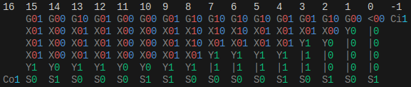
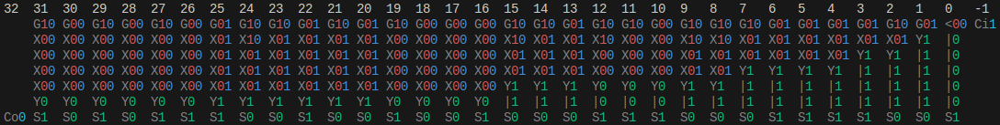
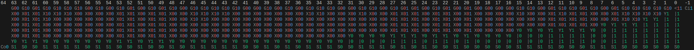

# Introduction

This project is primarily used by myself to learn about integrated logic circuits. It allows for the simulation of PUN finFETs, vias, and interconnects, allowing for relatively complex standard- and macro-cells to be simulated.

# How it works

## Vias

Vias are used for transmitting state from one point to another (i.e. single connection). Internally, it does this using `StateEffectors`. Here is a simple example:

```py
# used to identify which state to change on the via
>>> id_object_a = object()
>>> id_object_b = object()

>>> # callbacks for each state
>>> def callback_a(via: Via, state_changed: bool) -> None:
>>>     print(f"A triggered ({state_changed=})")
>>> def callback_b(via: Via, state_changed: bool) -> None:
>>>     print(f"B triggered ({state_changed=})")

>>> # create StateEffector instances
>>> effector_a = StateEffector(id_object_a, callback_a)
>>> effector_b = StateEffector(id_object_b, callback_b)

>>> # create via and register effectors
>>> via = Via()
>>> via.register(effector_a)
>>> via.register(effector_b)
```

If we set `A`'s state to `TRUE`, we would expect `callback_b` to be called, and `state_changed` to be `True` as the via is going from an un-energized state to an energized one:

```py
>>> via.set_state(id_object_a, True)
B triggered (state_changed=True)
```

If we now set `B`'s state to `TRUE`, `callback_a` gets called with `state_changed` equal to `False`, as the via is already energized.

```py
>>> via.set_state(id_object_b, True)
A triggered (state_changed=False)
```

A via is considered "energized" when one or both of its inputs are energized.

A special `Cap` state effector is also available, which allows for easy interaction with vias from the user's side when needed.

## Interconnects

Interconnects are used to connect one side of multiple vias together to propagate state. When any via (non-interconnect side) is energized, all other vias (interconnect side) in the interconnect are also energized. When all vias (non-interconnect side) are un-energized, all other vias (interconnect side) in the interconnect are also de-energized.

### Bindings

Bindings are just like interconnects, but are only used to connect exactly two vias. This allows for slightly simplified logic when we need a via-to-via connection.

## FinFETs

This program uses finFETs as the transistor architecture. Because we only simulate the PUN, we only use P-type finFETs, which work by allowing electron- (or in our case, state-) flow from the source to the drain only when the gate is ***not*** energized. This functionality is simulated in the `PTypeFinFET` class, with the `gate`, `source`, and `drain` vias exposed as attributes of the same name.

## Power

The power rail is used to simulate a constant energized state within the simulation, and is exposed as the `VDD` class. This class works by registering vias, then, once the full structure has been created, energizing the `VDD` to power all registered vias. For example:

```py
>>> vdd = VDD()

>>> via = Via()
>>> via.register(...) # some StateEffector; doesn't matter for this example

>>> vdd.register(via)

>>> via
Via[0 0]

>>> vdd.energize()
>>> via
Via[0 1]
```

## Putting it all together

Now that we have all the components we need, lets build a simple two-input NAND gate:

```py
>>> vdd = VDD()

>>> # create transistors
>>> p0 = PTypeFinFET()
>>> p1 = PTypeFinFET()

>>> # register transistor sources to power rail
>>> vdd.register(p0.source, p1.source)

>>> # output via
>>> output = Via()

>>> # interconnect the drains and output
>>> Interconnect(p0.drain, p1.drain, output)

>>> # rename the inputs
>>> input_a = p0.gate
>>> input_b = p1.gate

>>> # register Cap instances so we can interact with the vias more easily
>>> output.register(Cap())
>>> input_a.register(Cap())
>>> input_b.register(Cap())

>>> # energize the power rail
>>> vdd.energize()

>>> # in: 00, expected out: 1
>>> input_a.set_state(Cap, False)
>>> input_b.set_state(Cap, False)
>>> output
Via[1 0]

>>> # in: 01, expected out: 1
>>> input_a.set_state(Cap, False)
>>> input_b.set_state(Cap, True)
>>> output
Via[1 0]

>>> # in: 10, expected out: 1
>>> input_a.set_state(Cap, True)
>>> input_b.set_state(Cap, False)
>>> output
Via[1 0]

>>> # in: 11, expected out: 0
>>> input_a.set_state(Cap, True)
>>> input_b.set_state(Cap, True)
>>> output
Via[0 0]
```

## `SignalInterface`s

The `SignalInterface` is a helper class that allows for many vias' states to be set from a single integer. It is instantiated with an iterable containing multiple vias (which map from LSB to MSB), that can then be set from a single `set_signal` function, or accumulated with the `get_signal` function.

# Example of a macro-cell

One of the available macro-cells is a 64-bit radix-2 carry-in Kogge-Stone adder. Here is an example of it in action:

```py
# power rail
>>> vdd = VDD()

# create KSA and 
>>> ksa = KSA64R2Cin(vdd)
>>> ksa.cin.register(Cap())
>>> ksa.cout.register(Cap())
>>> i0_int = SignalInterface(ksa.i0)
>>> i1_int = SignalInterface(ksa.i1)
>>> o_int = SignalInterface(ksa.o)

# energize power rail
>>> vdd.energize()
```

Testing it with `0xa015785fb769250e` + `0x80000072f8710842` and `cin=True`, we expect to see an output of `0x201578d2afda2d51` and `cout=True`:

```py
# set inputs
>>> i0_int.set_signal(0xa015785fb769250e)
>>> i1_int.set_signal(0x80000072f8710842)
>>> ksa.cin.set_state(Cap, True)

>>> hex(o_int.get_signal())
0x201578d2afda2d51
>>> ksa.cout.energized
True
```

An interactive version of this example is available in the `main.py` script.

## State diagram

A diagram of this cell's state can also be accessed with the `.state_diagram()` method. Legend:

- `Gpg` - A PG generate cell with the outputs `p` and `g`.
- `Xpg` - A PG full merge cell (aka black cell) with the outputs `p` and `g`.
- `Yg` - A PG half merge cell (aka grey cell) with the output `g`.
- `|n` - A buffer cell with the output `n`. In this case, buffer cells are just used to carry values from previous levels.
- `Sn` - The final sum `n` for the respective bit.
- `Cin` - The carry-in value `n`.
- `Con` - The carry-out value `n`.

Example 16-bit:



Example 32-bit:



Example 64-bit:




# Running the tests

All standard- and macro-cells are full tested. To run the tests, make sure pytest is installed, then simply run the `pytest` command in the project's root directory.

# Pitfalls

This simulation has a number of pitfalls that are important to keep in mind:

1. We aren't actually simulating current flow. This has two major repercussions:
    1. We don't simulate the PDN.
    2. There is no concept of signal degradation, and therefore cell buffers aren't required.
2. The program is not designed to be fast, and is VERY inefficient. For example, setting all inputs on the `KSA64R2Cin` macro-cell takes around 4ms on a 4.5 GHz CPU.
